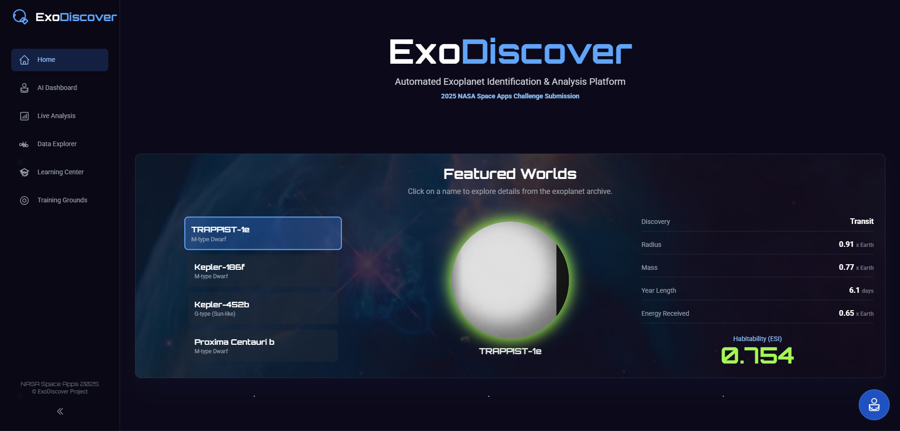
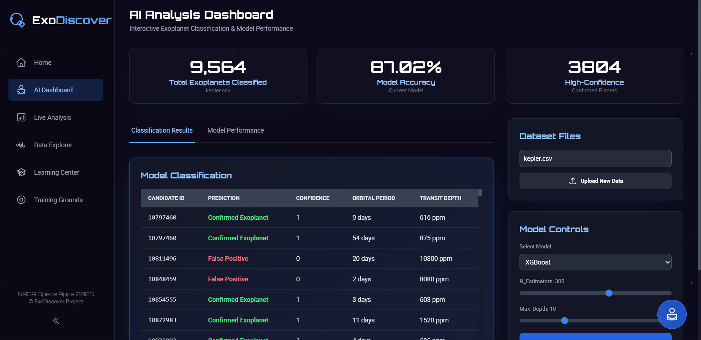
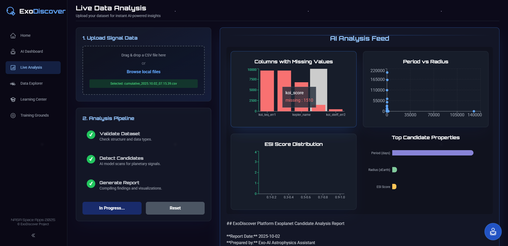
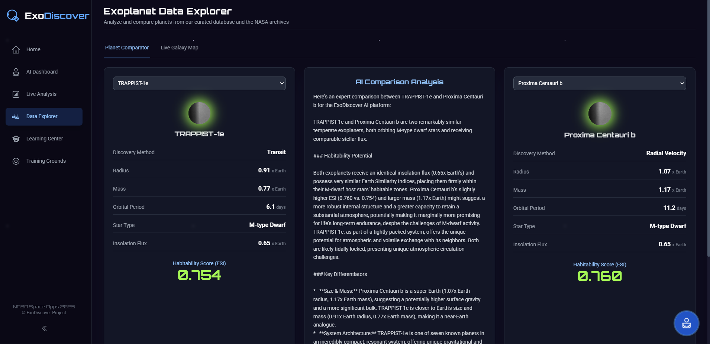
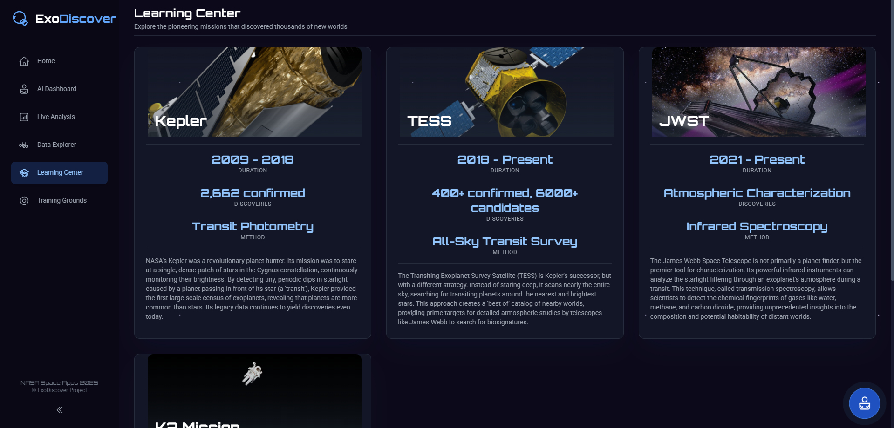
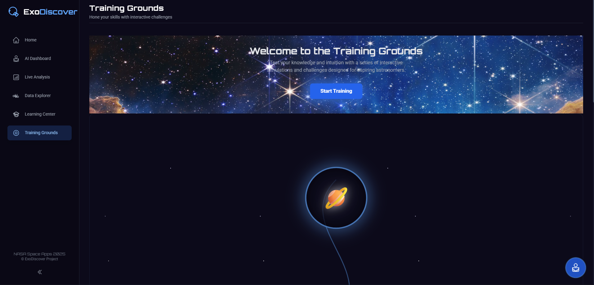
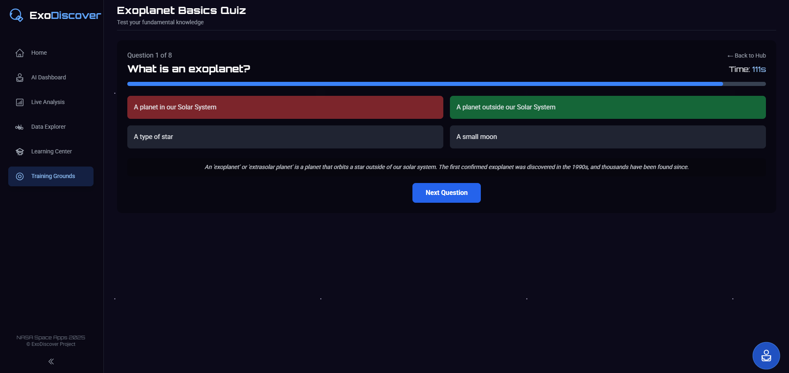
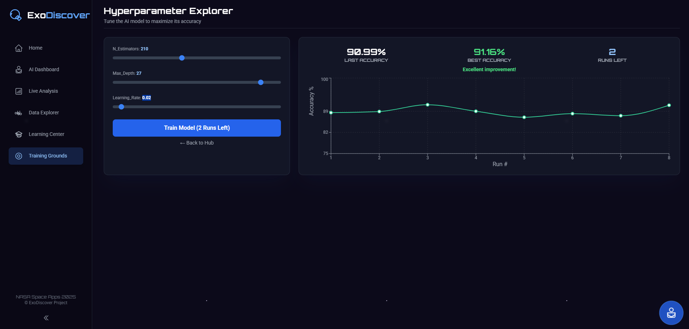

# MISSION-ABORT

Exoplanet discovery has advanced through missions like Kepler, K2, and TESS, which use the transit method to detect planets by observing dips in starlight. These missions provide publicly available datasets containing information on confirmed exoplanets, candidates, and false positives, including orbital periods, transit durations, and planetary radii. While much of the analysis has historically been manual, recent research shows that machine learning can automate exoplanet identification with high accuracy, especially when combined with proper data preprocessing. Leveraging these datasets can accelerate discoveries of previously hidden exoplanets.


## Installation

Follow these steps to install and run **MISSION-ABORT** locally:

### 1. Clone the repository
```bash
git clone https://github.com/Chinmay1318/MISSION-ABORT.git
```
### 2.Navigate into the project directory
```bash
cd MISSION-ABORT
```

### 3.Install dependencies

```bash
npm install 
```
### 4.Run the development Server

```bash
npm run dev
```

### 5.Running the backend Server
```bash
cd backend
uvicorn app:app --reload
```


### Requirement File

```text
@google/genai@latest
framer-motion@^12.23.22
papaparse@^5.5.3
react@18.2.0
react-dom@18.2.0
recharts@2.12.7

# Dev Dependencies
@types/node@^22.14.0
@vitejs/plugin-react@^5.0.0
typescript@~5.8.2
vite@^6.2.0
```
## 🛠️ Tech Stack

### Frontend
- **React 18** – UI library for building interactive user interfaces
- **TypeScript** – Adds type safety to JavaScript
- **Framer Motion** – Animation library for smooth UI transitions
- **Recharts** – Library for creating charts and graphs
- **Vite** – Fast frontend build tool

### Backend / API
- **FastAPI** – Python web framework for building APIs
- **Python 3.x** – Backend runtime
- **Pickle** – Store and load ML models for predictions

### Machine Learning
- **scikit-learn** – Core ML library for preprocessing and modeling
- **LightGBM** – Gradient boosting framework for high-performance ML
- **Gradient Boosting** – Ensemble method for predictive modeling


### Data / Utilities / API
- **PapaParse** – Parse CSV files easily in the browser
- **@google/genai** – Google GenAI SDK for AI/ML-related tasks
- **Gemini API** – For analysis and fetching exoplanetary data

### Development / Tooling
- **Vite Plugin React** – React plugin for Vite
- **TypeScript** – Type checking during development
- **Node.js** – Runtime environment for frontend
- **npm** – Package manager

---

## Table of Contents

- [Features](##features)
- [Project Structure](#project-structure)
- [Setup Instructions](#setup-instructions)
- [Usage](#usage)
- [API Reference](#api-reference)
- [Contributing](#contributing)
- [License](#license)

---

## Features

1. **AI-Powered Data Analysis**
   - Upload CSV datasets for automated analysis.
   - Detects patterns, anomalies, or candidates using AI.
   - Generates detailed AI-driven reports with insights.

2. **Live Signal Visualization**
   - Time-series graph plotting (light curves) for candidate signals.
   - Interactive charts with Recharts.
   - Candidate properties visualization: period, radius, ESI score.

3. **Candidate Detection**
   - Identifies potential candidates in datasets.
   - Provides confidence scores and key metrics.

4. **Step-wise Analysis Pipeline**
   - Upload → Validate → Analyze → Report → Complete.
   - Real-time status updates with animated indicators.

5. **Modern Responsive UI**
   - React + TypeScript frontend.
   - Tailwind CSS with animated cards, pulsing stars, and interactive tables.

6. **Gemini API Integration**
   - Generates live AI reports using Gemini API.
   - Requires `GEMINI_API_KEY` in `.env` file.

7. **Developer-Friendly Setup**
   - Drag-and-drop CSV upload.
   - Reset and rerun analysis without page reload.
   - Handles both time-series and static datasets.


## Screenshots

### 1.Hero Section 



### 2.AI Dashboard



### 3.Live Dataset Analysis 



### 4.Planet Explorer



### 5.Learning Center



### 6.Training Grounds 



### 7.Training Grounds -- > Quiz




### 8. Hyperparameter




